# SNMP demo
SNMP monitoring and alerting on RedHat OpenShift using Prometheus and Grafana operators

## Prerequisites

Have access to an OpenShift or Code Ready Containers environment.
This demo assumes all components shall be deployed inside the `snmp-demo` namespace.
Ensure you have access to the `oc` tool (the RedHat OpenShift command line tool).

### Operators Installation

Inside the `snmp-demo` namespace using the Administrator view of the OpenShift web-console, go to Operator Hub and install:
* Prometheus operator. Ensure it is installed only for the `snmp-demo` namespace.
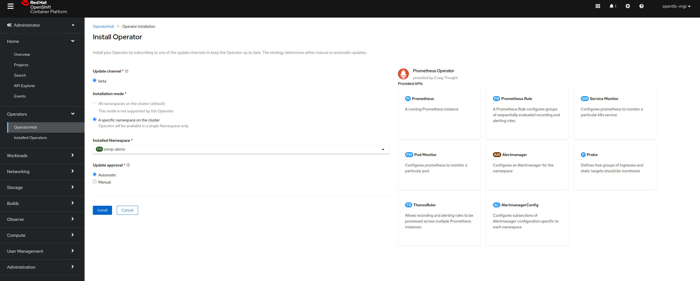
* Grafana operator. Ensure it is installed only for he `snmp-demo` namespace.
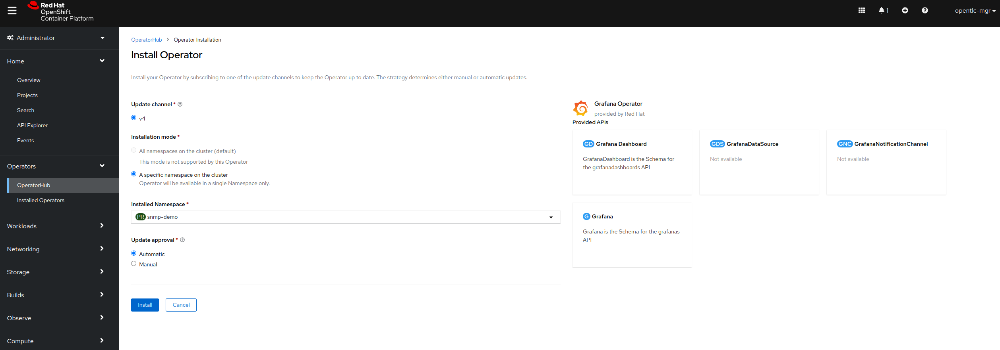

Depending on your cluster resource, this may take some time to complete the installation and internal configuration of the operators. Please wait until you see all the operator dashboards displaying the `Create Instance` for all the subcomponents of their respective operators.

For Prometheus you should have a view similar to the one below:
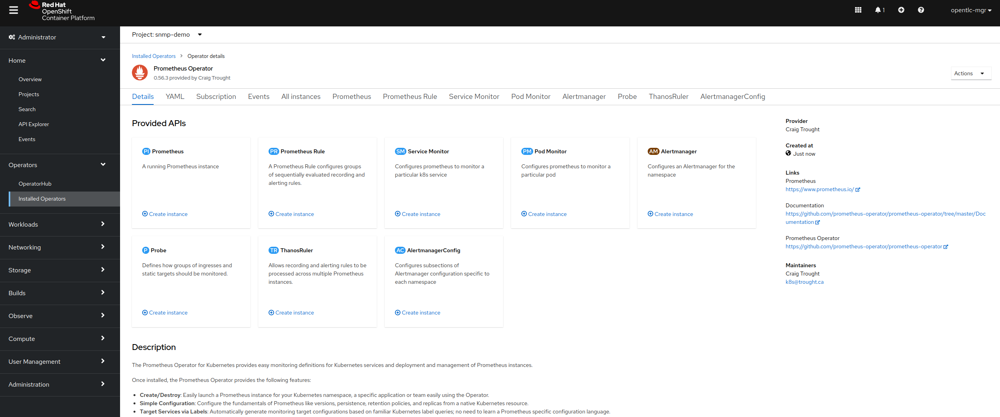

For Grafana you should have a view similar to the one below:
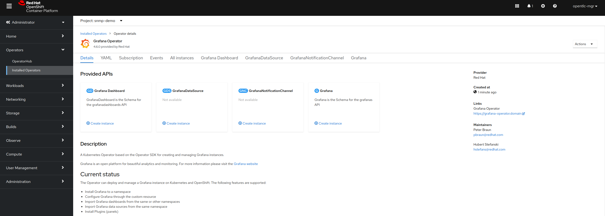

## Reproducing the demo
Please execute the steps in the order provided below. As a convention, a file name has in it's title the step number where it is supposed to be run.

### Step 1:
Create an AlertManager instance. This is where Prometheus will send configured alerts.
```
oc apply -f 01_alertmanager-alertmanager-main.yaml
```
Wait for the pod and service to be created. You can check this by running
```
oc get pods; oc get services
```

### Step 2:
 Create a Prometheus instance. As Prometheus is sending information to the AlertManager we had AlertManager created first.
 To create the Prometheus instance apply the required instance definition as follows:
 ```
 oc apply -f 02_prometheus-prometheus-snmp-demo.yaml
 ```
 
 Wait for the service and pod to be created before proceeding to the next step.
```
oc get pods; oc get services
```

### Step 3
Create rules for Prometheus for sending out alerts.
```
oc apply -f 03_prometheusrule-prometheus-snmp-exporter-rules.yaml
```
Prometheus will pick up the configuration in a few seconds (up to 30 seconds) and create the rule.

### Step 4
Make Prometheus' web-ui accessible by creating a route to expose the Prometheus (operated) service created in step 2.
```
oc apply -f 04_route-prometheus-snmp-demo.yaml
```

You can check the created route by issuing:
```
oc get routes
```

### Step 5
Make AlertManager's web-ui accessible by creating a route to epose the AlertManager (operated) service created in step 1.
```
oc apply -f 05_route-alert-manager-snmp-demo.yaml
```

You can get the route details by running again:
```
oc get rooutes
```

Later on, when alerts are received, they should be visible in the AlertManager's UI:
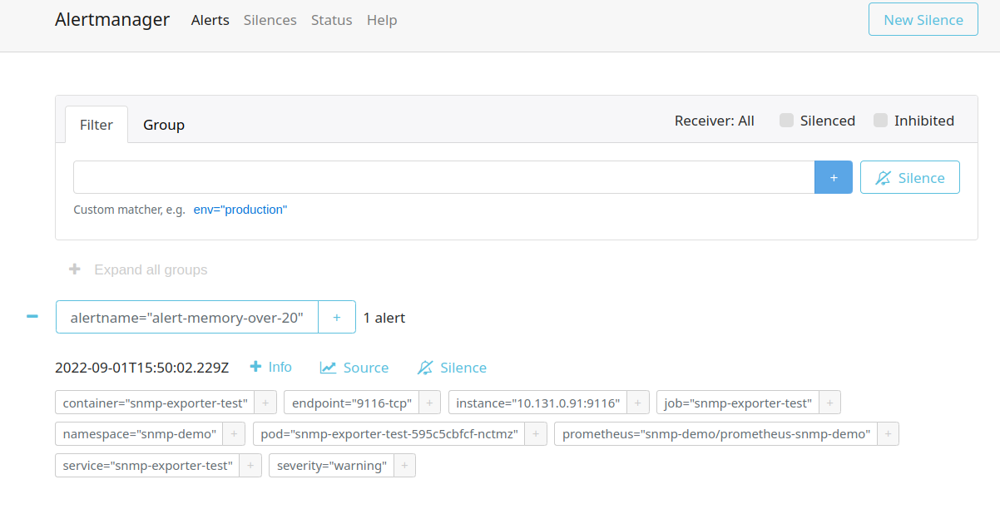

### Step 6

Switch to the Developer view in the RedHat OpenShift web-console and add a new Deployment from container images using the S2I function.
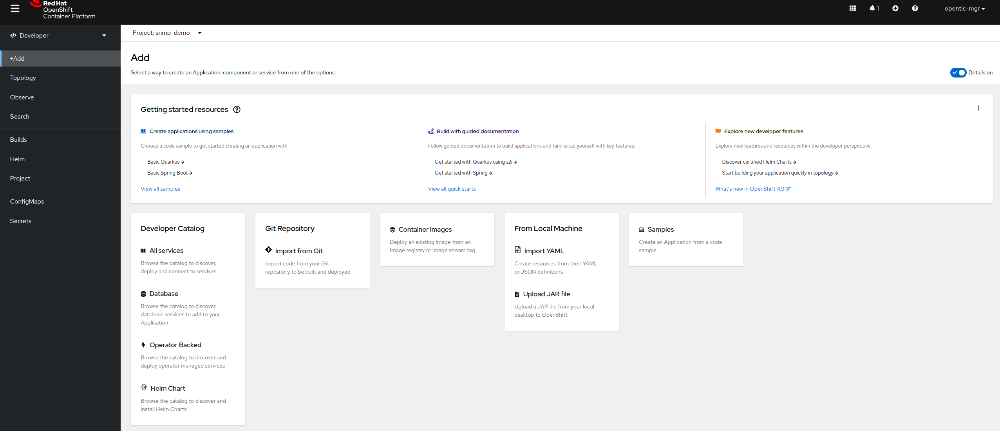

The container to be deployed is the `snmp-exporter-test` which has been specially packaged for this demo. It contains the `snmp-exporter` plugin from Prometheus that will translate SNMP information (using snmp walk/get methods) from a locally installed `snmpd`
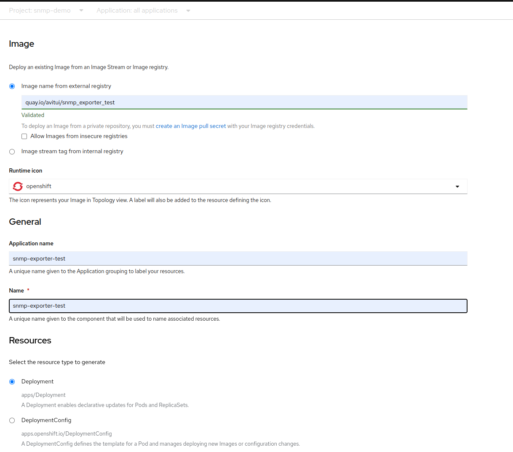

The image is located at `quay.io/avitui/snmp_exporter_test`. When doing the deployment ensure the Route configuration is configured to `secure with edge termination` and `redirect insecure connections` options and it is pointing to port `9116`, the port of snmp-exporter. Prometheus will scrape this port for events.
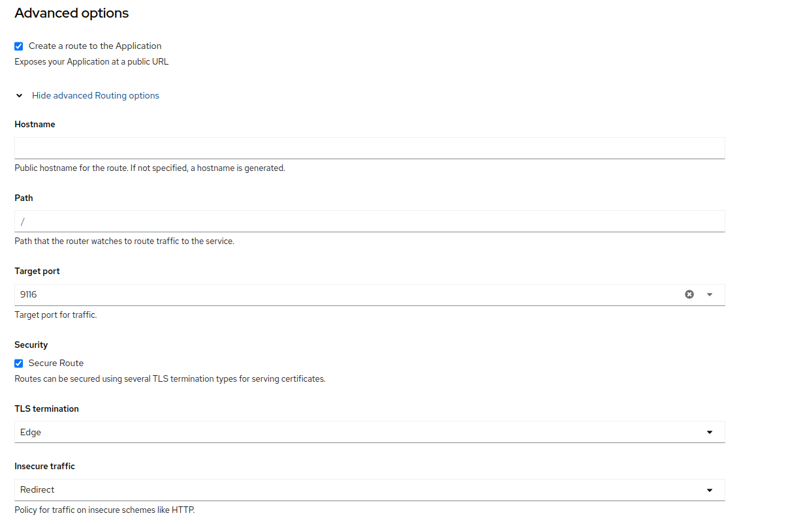

Wait until the deployment completes. You can check that by verifying the pod readiness using
```
oc get pods
```

Then, while still inside the `snmp-demo` namespace, run the following commands (one at a time):
```
oc create sa snmpdaemon
oc adm policy add-scc-to-user privileged -z snmpdaemon
oc patch deployment/snmp-exporter-test -p '{"spec":{"template":{"spec":{"securityContext":{"runAsUser": 0}}}}}'
oc patch deployment/snmp-exporter-test -p '{"spec":{"template":{"spec":{"serviceAccountName":"snmpdaemon"}}}}'
```

These are required to create a privileged user to allow the pod to run privileged (as root) so that the snmpd process starts inside the pod.
You can verify that by connecting to the pod (once it has been redeployed) by running the following command:
```
oc rsh $(oc get pods | grep snmp-exporter | awk '{print $1}')
```

Once inside the pod, execute:
```
netstat -tulnp
```
You should see in the results that both snmpd and snmp_exporter processes are running:
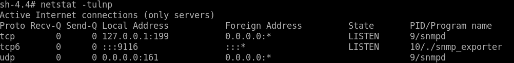

Exit the pod by typing `exit` or by pressing `<Ctrl-D>`

### Step 7

Switch back to Administrator view in the RedHat OpenShift web console and inside the `snmp-demo` project look into Networking->Services and edit the `snmp-exporter-test` service and add the following lines under the spec->ports area:

    - name: 161-udp
      protocol: UDP
      port: 161
      targetPort: 161
    - name: 199-tcp
      protocol: TCP
      port: 199
      targetPort: 199

Please mind the indentation. The file should look like below:
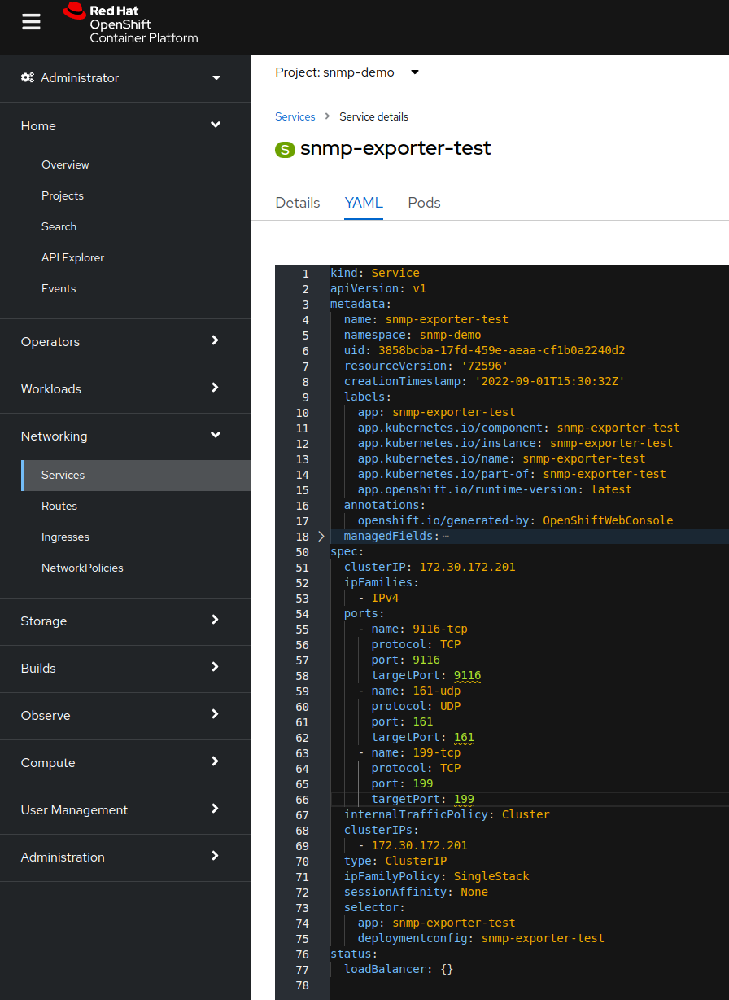
Now the service should have 3 exposed services, however only one external route is (optionally) required for the snmp_exporter 9116 web UI
Save and continue to the next step.

### Step 8
Create a ServiceMonitor to collect information for the `ucd-snmp` MIB module.
```
oc apply -f 08_servicemonitor-ucd-snmp-service-monitor.yaml
```

### Step 9
Create a ServiceMonitor to collect information for the `if-mib` MIB module.
```
oc apply -f 09_servicemonitor-if-mib-service-monitor.yaml
```

### Step 10
Similar to step 6, deploy the wiremock container to respond to alerts dispatched by the alert manager.
The container image is `quay.io/avitui/wiremock_for_alertmanager_test` and the running port should be `7777`.

### Step 11
Setup AlerManager to send out notifications
```
oc apply -f 11_alertmanagerconfig-snmpdemo-alertconfig.yaml
```

### Step 12
Create the Grafana instance
```
oc apply -f 12_grafana-grafana-snmp-demo.yaml
```
This will take a couple of minutes so please wait for the deployment to complete before going to the next step

### Step 13
Add a datasource for Grafana
```
oc apply -f 13_grafanadatasource-prom-ds-snmp-demo.yaml
```

### Step 14
Deploy the Grafana dashboard
```
oc apply -f 14_grafanadashboard-snmp-exp-demo.yaml
```
Once deployed the dashboard (inside the Grafana UI accessible via the Networking->Routes menu of the RedHat OpenShift Console Administrator mode view) should look like below:


### Step 15.
In order to generate alerts for the Prometheus rule (created at step 3), the used memory of the snmp-exporter pod must go above 20%, 50% and 70% respectively.
To trigger a memory usage increase for the pod, connect to the pod and execute an existing script created for this purpose as follows:
```
oc rsh $(oc get pods | grep snmp-exporter | awk '{print $1}')
```
Once connected execute the following:
```
cd /root
python create_large_list.py
```

Leave the terminal open and the script running until alerts are generated.
Alerts can also be seen inside Prometheus' web-ui and they should look as in the below image:
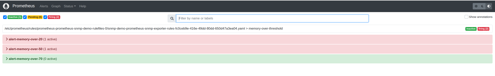

## End of Demo


